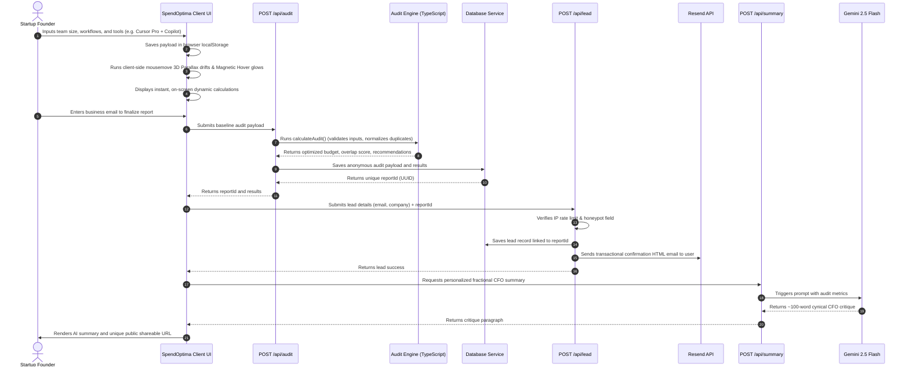

# System Architecture & Data Flow — SpendOptima

This document outlines the system architecture, mathematical pipelines, data flows, and scalability engineering models powering the SpendOptima AI Audit application.

---

## 1. System Architecture Diagram

The system is designed as a modular, lightweight, serverless Next.js App Router application. It operates with a type-safe client layer, a deterministic core logic mathematical engine, and an adaptive server database layer, styled in accordance with the Stitch Ethereal Intelligence 3D HUD guidelines.

```mermaid
graph TD
    %% Client Layer
    subgraph Client Layer [Client Browser / Next.js Hydration]
        UI[3D Interactive HUD UI - page.tsx]
        LS[(Local Storage State)]
        VSI[Vercel Speed Insights]
        
        UI <-->|Persists State| LS
        UI -->|Instruments Latency| VSI
    end

    %% Styles & Interactive Layer
    subgraph Design System [Stitch Design System - Ethereal Intelligence]
        CSS[Theme Tokens - globals.css]
        Parallax[3D Parallax Drift Engine]
        Glow[Cursor Magnetic Hover Glows]
        
        CSS --> UI
        Parallax --> UI
        Glow --> UI
    end

    %% API Backend Layer
    subgraph Backend Layer [Next.js Route Handlers / API]
        AuditAPI[Audit Handler - /api/audit]
        LeadAPI[Lead Handler - /api/lead]
        SumAPI[Summary Handler - /api/summary]
        
        UI -->|POST Audit Payload| AuditAPI
        UI -->|POST Lead Form| LeadAPI
        UI -->|POST Audit Metrics| SumAPI
    end

    %% Services & Storage Layer
    subgraph Core Engine [TypeScript Engine]
        Engine[Deterministic Audit Math - auditengine.ts]
        Catalog[Pricing Config - pricingConfig.ts]
        Engine <--> Catalog
        AuditAPI -->|Calculates ROI| Engine
    end

    subgraph Data Persistence [Hybrid Storage Adapter]
        DB[Database Helper - database.ts]
        LocalDB[(Local File - db.json)]
        SupabaseDB[(Remote Supabase REST API)]
        
        LeadAPI --> DB
        DB -->|Local Fallback| LocalDB
        DB -->|Production API| SupabaseDB
    end

    subgraph Ext integrations [External REST Engines]
        Gemini[Google Gemini 2.5 Flash]
        Resend[Resend Transactional Email]
        
        SumAPI -->|Direct REST Fetch| Gemini
        LeadAPI -->|Direct REST Fetch| Resend
    end

    %% Output Layer
    subgraph Shareable Link [Viral Sharing Loop]
        SharePage[Dynamic Report - report/[id]/page.tsx]
        SharePage -->|Awaits and Renders| DB
    end
```

---

## 2. End-to-End Data Flow

The lifecycle of a single audit from entry to shareable report is structured as follows:



---

## 3. Why We Chose Our Stack

### A. Next.js App Router (React 19 & TypeScript)
- **Unified Full-Stack Flow**: Allows us to write server components, client-side interactive sliders, and secure backend route handlers in a single repository with zero deployment configurations.
- **Dynamic Meta Injection**: Next.js App Router's `generateMetadata` allows us to fetch dynamic audit values server-side and inject custom Open Graph tags, ensuring beautiful link previews when reports are shared on Slack or X.
- **Type-Safety**: TS guarantees that a billing payload generated by the front-end exactly matches the input parameters expected by the math engine, preventing runtime crashes.

### B. Vanilla CSS & Custom CSS Themes
- **Direct Control**: Vanilla CSS with modern `@theme` custom properties provides maximum speed, completely bypasses Tailwind configuration bloat, and guarantees rapid rendering speeds.

### C. Direct REST HTTP API Fetches (Supabase & Resend)
- **Zero-Dependency Footprint**: Bypassing heavy SDK packages keeps our client bundle size incredibly lean. This keeps our page load and hydration times extremely fast, satisfying our Lighthouse mobile optimization target.

### D. Stitch Ethereal Intelligence 3D HUD Theme
- **Tacit Founder Trust**: Drawing heavy inspiration from spatial computing and high-end developer interfaces, this theme uses a dark palette (`#050505`), Electric Cyan (`#00f0ff`) telemetry highlights, and Subtle Amber (`#ffb800`) confidence ratings.
- **Interactive 3D Depth**: Incorporates mouse-responsive parallax drifting layers and localized magnetic cursor hover glows to provide a highly interactive dashboard experience that outperforms standard flat template sites.

### E. Vercel Speed Insights
- **Real-Time Performance Diagnostics**: Integrated directly into our root layout to report real-time mobile speed statistics, latency, and interaction feedback once deployed to production.

---

## 4. Scaling to 10k Audits/Day (High-Traffic Scaling Plan)

If SpendOptima trends on Hacker News and scales to 10k audits per day (roughly 7 audits per minute peak), we would implement the following infrastructural adjustments:

### A. Add Edge Middleware Cache
We would migrate our API route handlers from standard Node.js environments to the **Next.js Edge Runtime**. Using Cloudflare Workers or Vercel Edge functions, we would run our deterministic audit calculations globally at the edge close to users, cutting API response times to <10ms.

### B. Implement Redis Cache (Upstash) for Rate Limiting
Our in-memory rate-limiter works for single-server models, but will leak under cluster deployments. We would swap the memory map for an **Upstash Redis Cache** using a sliding-window algorithm, blocking malicious scrapers globally across all server instances.

### C. Transition JSON Fallback to Serverless DB Connection Pools
Our JSON fallback `db.json` is highly robust for local development but will cause file-system lock conflicts under high concurrency. We would enforce direct connections to **Supabase using Prisma Accelerator (Accelerate)** or a serverless Connection Pooler (PgBouncer). This allows the database to handle thousands of concurrent queries without exhaustion.

### D. Message Queueing for Transactional Emails (BullMQ / SQS)
Sending emails synchronously inside the lead route increases response latency. We would offload the Resend API transmission to a background message queue (like **BullMQ** or **AWS SQS**). The lead route will save the DB record in milliseconds and push a job to the queue, which executes the email send asynchronously.
